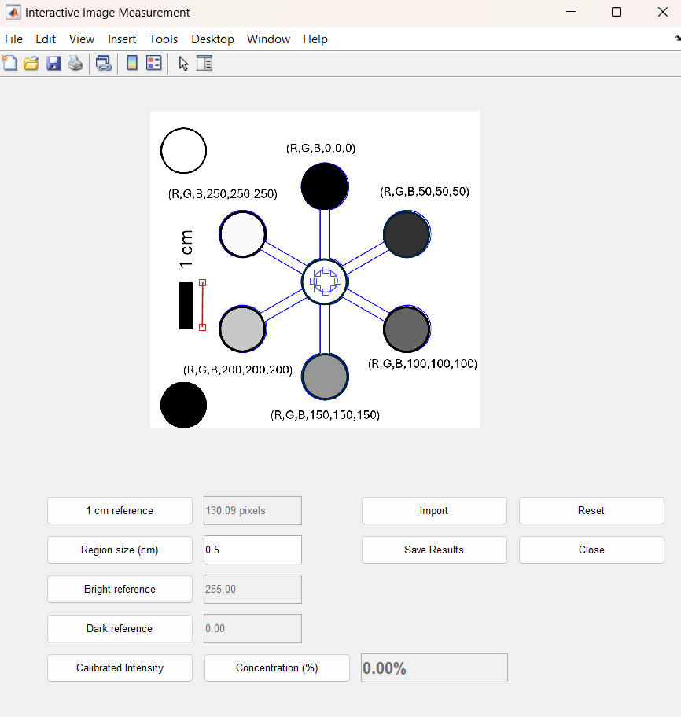

# GrayscaleCalibrator2025

**GrayscaleCalibrator2025** is an interactive MATLAB-based application designed for grayscale intensity calibration and image-based measurement tasks, particularly useful in colorimetry, grayscale analysis, and material concentration estimation using photographic inputs.



## 🔍 Features

- 📷 **Image Upload & Display**
- 📏 **1 cm Reference Calibration** using interactive line selection
- ⚪ **Custom Region Selection** using circular masks
- ⚪ **White & Black Reference Calibration**
- 📈 **Calibrated Grayscale Intensity Calculation**
- 💧 **Concentration Estimation (%)** based on grayscale values
- 💾 **Result Export** to text files
- 🔁 **Reset Functionality** to clear session data
- ✅ **Simple GUI** built with native MATLAB tools

## 🧪 Use Cases

- Material colorimetry using grayscale images
- Optical density and concentration estimation
- Comparative analysis of brightness/darkness regions
- Educational tool for image-based measurements

## 🚀 Getting Started

### Prerequisites

- MATLAB R2021b or later
- Image Processing Toolbox

### How to Run

1. Clone or download this repository:
    ```bash
    git clone https://github.com/your-username/GrayscaleCalibrator2025.git
    ```
2. Open MATLAB.
3. Navigate to the project folder.
4. Run the main script:
    ```matlab
    GrayscaleCalibrator2025.p
    ```

## 📂 Project Structure

```
GrayscaleCalibrator2025/
├── GrayscaleCalibrator2025.p               # Main protected script
├── example_images/                         # Optional sample images
├── results.txt                             # Output (example)
└── README.md
```

## 🧠 Notes

- Ensure you set the **1 cm reference** before trying to place or calibrate any measurement region.
- References (bright and dark) must be captured from **within the selected region**.

## 📝 License

This project is licensed under the MIT License - see the [LICENSE](LICENSE) file for details.

## 🙋‍♀️ Contributions & Feedback

Contributions, bug reports, and suggestions are welcome. Feel free to open issues or pull requests.

---

© 2025 GrayscaleCalibrator Team
